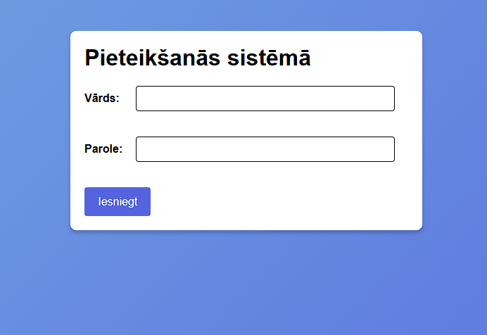
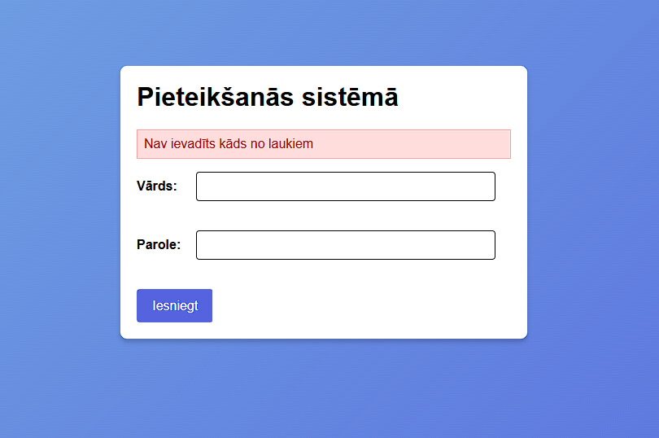
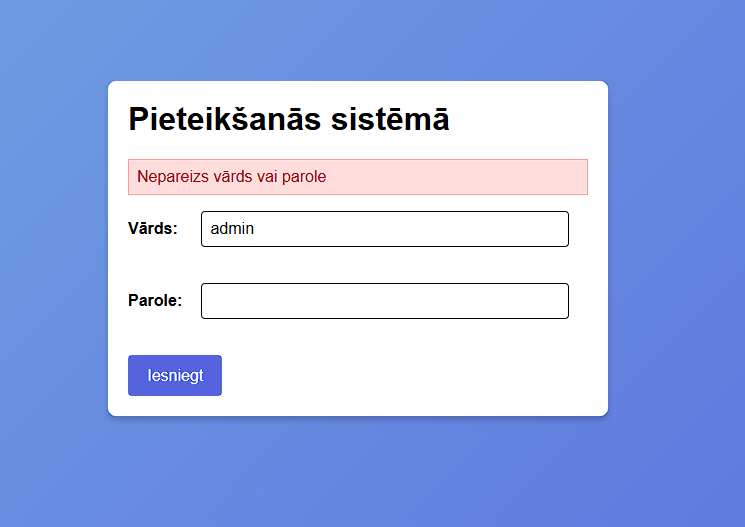
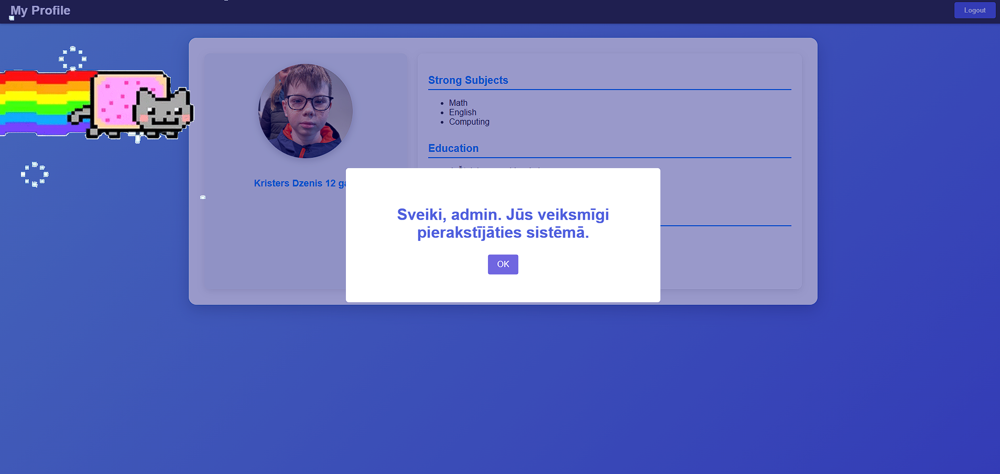
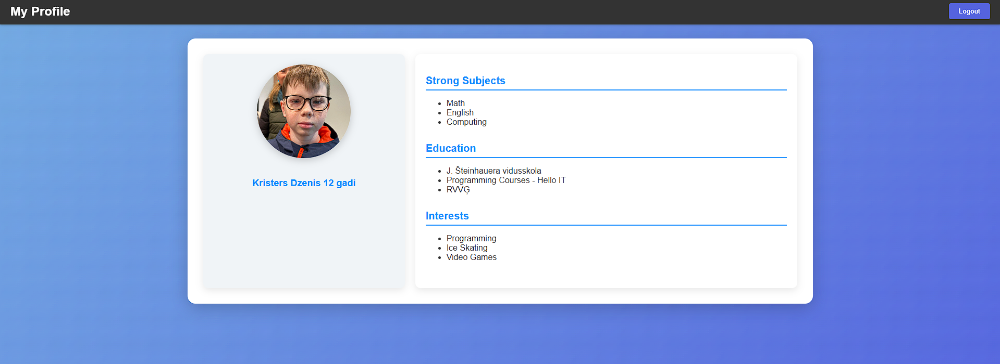
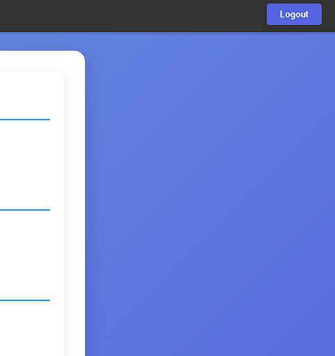

# Pieteikšanās forma

# Kļūda, ja nav aizpildīts kāds no laukiem

# Kļūda, ja nav pareiza parole vai lietotājvārds

# Kļūda, ja nav pareiza parole vai lietotājvārds

# Veiksmīga pieteikšanās sistēmā
- sveiciens, kas tiek parādīts lietotājam
- pēc veiksmīgas pieteikšanās sistēmā tiek atvērta lietotāja profila lapa

# Profila lapa
- info par lietotāju

# iziešanas poga
- iziet no lietotāja profila un neļaut vairs skatīties lietotāja datus

