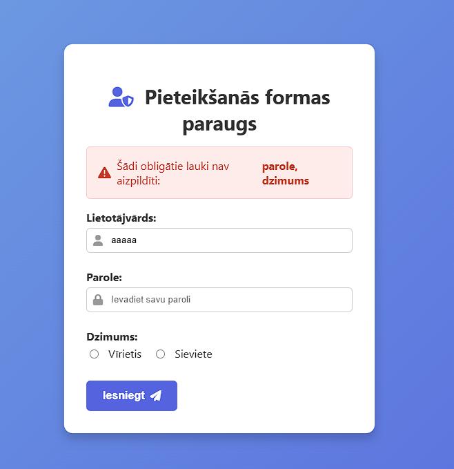

<details>
  <summary><strong>Uzdevuma apraksts (Lietotāja stāsts)</strong></summary>

**Ko veidojam:**  
Izveidojam pieteikšanās lapu, kurā lietotājs ievada:
- Lietotājvārdu,
- Paroli,
- Dzimumu (radio pogas: vīrietis vai sieviete).

**Funkcionalitāte:**  
- Ja kāds lauks ir tukšs vai lietotājvārds/parole neatbilst, sistēma saglabā kļūdu paziņojumu un jau ievadītos datus (izņemot paroli) sesijā.  
- Lietotājs tiek novirzīts atpakaļ uz formu, kur kļūdas paziņojums tiek parādīts lapas augšdaļā, un ievadītie dati tiek atkārtoti aizpildīti formā.  
- Ja dati ir pareizi, tiek parādīts sveiciens un paziņojums, ka lietotājs ir veiksmīgi pieteicies.

**Temati:**  
- HTML formas izveide  
- CSS stils  
- PHP mainīgie, masīvi un nosacījumu izteiksmes  
- PHP sesiju izmantošana un datu saglabāšana  
- Novirzīšana ar header() un exit() funkcijām  
- Datu validācija un drošības pasākumi (piemēram, htmlspecialchars)

**Noderīgie resursi**  
- [PHP Getting Started](https://www.w3schools.com/php/php_getstarted.php)  
- [PHP Sessions](https://www.w3schools.com/php/php_sessions.asp)  
- [HTML Tutorial](https://www.w3schools.com/html/default.asp)  
- [CSS Tutorial](https://www.w3schools.com/css/)
- [PHP password hashes](https://www.php.net/manual/en/function.password-hash.php)

**Paraugs**  


**Kļūdu parādīšana**  


</details>

---

Zemāk atradīsi soli-pa-solim izskaidrotu piemēru ar **diviem** failiem: **index.php** (forma un sākotnējā lapas daļa) un **action.php** (formas apstrāde). Katra soļa beigās pievienots attiecīgais koda fragments, lai varētu saprast, kā viss kopā darbojas. Pēc tam ir pievienots **kopējais gala kods**, kur viss ir salikts pareizajā secībā un gatavs lietošanai.

---

## 1. HTML pamata izveide

1. Izveido failu **index.php**.  
2. Tajā uzraksti HTML galveno struktūru: `<!DOCTYPE html>`, `<html>`, `<head>` un `<body>`.  
3. Pievieno `<meta charset="UTF-8">`, lai nodrošinātu latviešu burtu pareizu attēlošanu.

**index.php (sākums)**:
```html
<!DOCTYPE html>
<html lang="lv">
<head>
  <meta charset="UTF-8">
  <title>Pieteikšanās forma</title>
</head>
<body>

  <!-- Šeit tālāk pievienosim laukus (2. solis), stilus (3. solis) u.c. -->

</body>
</html>
```

---

## 2. Lauku pievienošana

1. Tajā pašā **index.php** failā (starp `<body>` un `</body>`) pievieno HTML ievades laukus:
   - **Lietotājvārds** (teksta lauks)
   - **Parole** (paroles lauks)
   - **Dzimums** (radio pogas: “Vīrietis” un “Sieviete”)
   - **Poga** “Iesniegt”

2. Izveido `<form>` tagu, kas aptvers šos laukus. (Pagaidām `action` un `method` varam norādīt, bet plašāk to apskatīsim nākamajos soļos.)

**index.php (pievienojam laukus)**:
```html
<!DOCTYPE html>
<html lang="lv">
<head>
  <meta charset="UTF-8">
  <title>Pieteikšanās forma</title>
</head>
<body>

  <h1>Pieteikšanās lapa</h1>

  <form action="action.php" method="post">
    <!-- Lietotājvārds -->
    <label for="id_username">Lietotājvārds:</label>
    <input type="text" id="id_username" name="username"><br><br>

    <!-- Parole -->
    <label for="id_password">Parole:</label>
    <input type="password" id="id_password" name="password"><br><br>

    <!-- Dzimums (radio pogas) -->
    <label>Dzimums:</label>
    <input type="radio" id="gender_male" name="gender" value="male">
    <label for="gender_male">Vīrietis</label>

    <input type="radio" id="gender_female" name="gender" value="female">
    <label for="gender_female">Sieviete</label>
    <br><br>

    <!-- Poga iesniegšanai -->
    <input type="submit" value="Iesniegt">
  </form>

</body>
</html>
```

---

## 3. Stilu pievienošana

1. Tajā pašā failā **index.php** sadaļā `<head>` ievieto `<style>` tagu, lai veidotu vienkāršus stilus:
   - Fona krāsa
   - Fonta tipa iestatījumi
   - Formas un ievades lauku izkārtojums

2. Šis solis palīdzēs redzēt, ka ar pāris CSS rindām var jau padarīt lapu glītāku.

**index.php (ar sākotnējiem stiliem)**:
```html
<!DOCTYPE html>
<html lang="lv">
<head>
  <meta charset="UTF-8">
  <title>Pieteikšanās forma</title>
  <style>
    body {
      background-color: #f7f7f7;
      font-family: Arial, sans-serif;
      max-width: 500px;
      margin: auto; /* Lai centriski */
      padding: 1rem;
    }

    form {
      background-color: #fff;
      padding: 1rem;
      border-radius: 8px;
      box-shadow: 0 4px 6px rgba(0, 0, 0, 0.1);
    }

    label {
      font-weight: bold;
    }

    input[type="text"],
    input[type="password"] {
      width: 100%;
      padding: 0.5rem;
      margin-top: 0.5rem;
      margin-bottom: 1rem;
      border: 1px solid #ccc;
      border-radius: 4px;
    }

    input[type="radio"] {
      margin: 0 0.5rem 0 0;
    }

    input[type="submit"] {
      background-color: #3498db;
      color: #fff;
      padding: 0.7rem 1.2rem;
      border: none;
      border-radius: 4px;
      cursor: pointer;
    }

    input[type="submit"]:hover {
      background-color: #2980b9;
    }
  </style>
</head>
<body>

  <h1>Pieteikšanās lapa</h1>

  <form action="action.php" method="post">
    <label for="id_username">Lietotājvārds:</label>
    <input type="text" id="id_username" name="username">

    <label for="id_password">Parole:</label>
    <input type="password" id="id_password" name="password">

    <label>Dzimums:</label>
    <input type="radio" id="gender_male" name="gender" value="male">
    <label for="gender_male">Vīrietis</label>
    <input type="radio" id="gender_female" name="gender" value="female">
    <label for="gender_female">Sieviete</label>
    <br><br>

    <input type="submit" value="Iesniegt">
  </form>

</body>
</html>
```

---

## 4. Darbības (action) pievienošana

- Mūsu formā jau ir `action="action.php"` un `method="post"`.  
- Tas nozīmē, ka, **iesniedzot** formu, dati tiks nosūtīti uz **action.php** failu, izmantojot **POST** metodi.  
- Tagad izveidosim pašu **action.php** failu, taču pagaidām tas būs pavisam vienkāršs.

**action.php (tukšs, lai redzam struktūru)**:
```php
<?php
// Šeit vēlāk rakstīsim koda daļas, lai apstrādātu formu
echo "Te tiks apstrādāti formas dati!"; 
```

---

## 5. Action apstrāde (vienkārši nolasām datus)

1. Failā **action.php** sākam iegūt datus no `$_POST`.  
2. Pagaidām vienkārši izmēģinām izvadīt, ko lietotājs ir ievadījis.

**action.php (pamata apstrāde)**:
```php
<?php
// Iegūstam datus no formas
$username = $_POST['username'];
$password = $_POST['password'];
$gender   = $_POST['gender'];

// Izvadām testa informāciju (ar echo tikai testēšanai)
echo "Jūs ievadījāt lietotājvārdu: " . $username . "<br>";
echo "Jūs ievadījāt paroli: " . $password . "<br>";
echo "Jūsu dzimums ir: " . $gender . "<br>";
```

---

## 6. Lauku validācija

1. Mums jāpārbauda, vai lietotājs **vispār ir kaut ko ievadījis**.  
2. Ja kaut kas nav ievadīts, paziņojam, ka trūkst lauku, un nedodamies tālāk.

**action.php (ar lauku pārbaudi)**:
```php
<?php
$username = isset($_POST['username']) ? trim($_POST['username']) : '';
$password = isset($_POST['password']) ? trim($_POST['password']) : '';
$gender   = isset($_POST['gender'])   ? trim($_POST['gender'])   : '';

// Masīvs, kur glabāsim, kuri lauki ir tukši
$missing_fields = [];

// Pārbaudām katru lauku
if ($username === '') {
    $missing_fields[] = 'Lietotājvārds';
}
if ($password === '') {
    $missing_fields[] = 'Parole';
}
if ($gender === '') {
    $missing_fields[] = 'Dzimums';
}

// Ja masīvs nav tukšs (ir tukši lauki)
if (!empty($missing_fields)) {
    echo "Nepieciešams aizpildīt laukus: " . implode(', ', $missing_fields);
    // Šeit varam beigt skriptu
    exit();
}

// Ja viss ir aizpildīts, turpinām...
echo "Labi! Visi lauki aizpildīti.<br>";
echo "Lietotājvārds: $username<br>";
echo "Dzimums: $gender<br>";
```

---

## 7. Sesijas pievienošana

1. Tagad pievienosim **sesiju**, lai saglabātu kļūdas paziņojumus un jau ievadītos datus.  
2. Sesiju vispirms **jāuzsāk** gan failā **index.php**, gan **action.php** (vispirms, pašā faila augšpusē).  
3. Izmantojot `$_SESSION`, varēsim saglabāt un vēlāk atkal iegūt nepieciešamos datus.

**index.php (tagad ar session_start())**:
```php
<?php
session_start();
?>
<!DOCTYPE html>
<html lang="lv">
<head>
  <meta charset="UTF-8">
  <title>Pieteikšanās forma</title>
  <style>
    /* CSS stili kā iepriekš */
  </style>
</head>
<body>
  <h1>Pieteikšanās lapa</h1>
  
  <!-- (Šeit vēl pievienosim koda fragmentu kļūdu parādīšanai un sesijas datu atkārtotai ielādei) -->

  <form action="action.php" method="post">
    <!-- Tajā pašā veidā, kā iepriekš -->
  </form>
</body>
</html>
```

**action.php (ar session_start() augšpusē):**
```php
<?php
session_start(); // Sākam sesiju

$username = isset($_POST['username']) ? trim($_POST['username']) : '';
$password = isset($_POST['password']) ? trim($_POST['password']) : '';
$gender   = isset($_POST['gender'])   ? trim($_POST['gender'])   : '';

$missing_fields = [];

// Pārbaudām tukšos laukus
if ($username === '') {
    $missing_fields[] = 'Lietotājvārds';
}
if ($password === '') {
    $missing_fields[] = 'Parole';
}
if ($gender === '') {
    $missing_fields[] = 'Dzimums';
}

// Ja kāds lauks nav aizpildīts
if (!empty($missing_fields)) {
    // Saglabājam kļūdas paziņojumu sesijā
    $_SESSION['errors'] = "Nepieciešams aizpildīt laukus: " . implode(', ', $missing_fields);

    // Saglabājam ievadītos laukus (lai var atkārtoti parādīt formā)
    $_SESSION['old_data'] = [
        'username' => $username,
        'gender'   => $gender
        // Paroli drošības apsvērumu dēļ parasti nesaglabā
    ];

    // Novirzām atpakaļ uz index.php
    header("Location: index.php");
    exit();
}

// Ja viss ir kārtībā, šajā brīdī varam pārbaudīt, vai lietotājvārds un parole ir "pareizi"
// (piemēram, salīdzināt ar iepriekš definētu masīvu vai DB ierakstu).
// Piemēra variantā izveidosim testam masīvu ar lietotājiem:

$users = [
  'admin' => 'admin123',
  'user1' => 'mypassword'
];

if (array_key_exists($username, $users) && $users[$username] === $password) {
    // Pareizs lietotājs un parole
    echo "Sveiks, " . htmlspecialchars($username) . "! Tu esi veiksmīgi pieteicies.<br>";
    echo "Tavs dzimums: " . htmlspecialchars($gender);
} else {
    // Nepareizs lietotājvārds vai parole
    $_SESSION['errors'] = "Nepareizs lietotājs vai parole.";
    $_SESSION['old_data'] = [
        'username' => $username,
        'gender'   => $gender
    ];
    header("Location: index.php");
    exit();
}
```

---

## 8. Atgriešanās pie formas un sesijas datu izmantošana

1. Kad mēs atgriežamies pie formas **index.php**, ja sesijā ir kļūdas vai ievadītie dati, tos varam parādīt.  
2. Pārbaudām `$_SESSION['errors']` un izvadām kļūdu paziņojumu, ja tāds ir.  
3. Izmantojot `$_SESSION['old_data']`, iestādām `<input>` laukumam `value=""`, lai atcerētos agrāk ierakstīto lietotājvārdu.

**index.php (ar kļūdu paziņojumu un ievadīto datu saglabāšanu):**
```php
<?php
session_start();

// Saglabā kļūdu paziņojumu mainīgajā un pēc tam to no sesijas izdzēšam
$error_message = isset($_SESSION['errors']) ? $_SESSION['errors'] : '';
unset($_SESSION['errors']);

// Saglabā old_data un pēc tam izdzēšam
$old_data = isset($_SESSION['old_data']) ? $_SESSION['old_data'] : [];
unset($_SESSION['old_data']);
?>
<!DOCTYPE html>
<html lang="lv">
<head>
  <meta charset="UTF-8">
  <title>Pieteikšanās forma</title>
  <style>
    body {
      background-color: #f7f7f7;
      font-family: Arial, sans-serif;
      max-width: 500px;
      margin: auto;
      padding: 1rem;
    }
    form {
      background-color: #fff;
      padding: 1rem;
      border-radius: 8px;
      box-shadow: 0 4px 6px rgba(0, 0, 0, 0.1);
    }
    label {
      font-weight: bold;
    }
    input[type="text"],
    input[type="password"] {
      width: 100%;
      padding: 0.5rem;
      margin-top: 0.5rem;
      margin-bottom: 1rem;
      border: 1px solid #ccc;
      border-radius: 4px;
    }
    input[type="radio"] {
      margin: 0 0.5rem 0 0;
    }
    input[type="submit"] {
      background-color: #3498db;
      color: #fff;
      padding: 0.7rem 1.2rem;
      border: none;
      border-radius: 4px;
      cursor: pointer;
    }
    input[type="submit"]:hover {
      background-color: #2980b9;
    }
    .error {
      background-color: #fdd;
      border: 1px solid #f99;
      color: #900;
      padding: 0.5rem;
      margin-bottom: 1rem;
      border-radius: 4px;
    }
  </style>
</head>
<body>

  <h1>Pieteikšanās lapa</h1>

  <!-- Ja ir kļūdas, parādām tās -->
  <?php if ($error_message): ?>
    <div class="error"><?php echo $error_message; ?></div>
  <?php endif; ?>

  <form action="action.php" method="post">
    <label for="id_username">Lietotājvārds:</label>
    <input 
      type="text" 
      id="id_username" 
      name="username" 
      value="<?php echo isset($old_data['username']) ? htmlspecialchars($old_data['username']) : ''; ?>"
    >

    <label for="id_password">Parole:</label>
    <input 
      type="password" 
      id="id_password" 
      name="password"
    >

    <label>Dzimums:</label>
    <input 
      type="radio" 
      id="gender_male" 
      name="gender" 
      value="male" 
      <?php echo (isset($old_data['gender']) && $old_data['gender'] === 'male') ? 'checked' : ''; ?>
    >
    <label for="gender_male">Vīrietis</label>

    <input 
      type="radio" 
      id="gender_female" 
      name="gender" 
      value="female" 
      <?php echo (isset($old_data['gender']) && $old_data['gender'] === 'female') ? 'checked' : ''; ?>
    >
    <label for="gender_female">Sieviete</label>
    <br><br>

    <input type="submit" value="Iesniegt">
  </form>

</body>
</html>
```

---

## 9. Sesijas “notīrīšana” (unset) un drošība

- Mēs jau `unset($_SESSION['errors'])` un `unset($_SESSION['old_data'])` izmantojam, lai nodzēstu sesijas ziņojumus pēc tam, kad tos esam izvadījuši.  
- Papildus drošības pasākums: lietot lietotājvārdu un dzimumu izvadē apstrādājam ar `htmlspecialchars()`, lai izvairītos no HTML injekcijām.

(Šo jau esam ieviesuši. Neko speciāli vairāk nav jādara, var pieminēt, ka realitātē paroli nekad nesaglabājam ne `$_SESSION['old_data']`, ne HTML.)

---

## 10. Stilu papildināšana

- Ja vēlies, vari pievienot vēl stilus:  
  - Peldošs rāmis ap formu,  
  - Pamīšus krāsas,  
  - Pogas animācijas utt.

Piemēram, neliels “hover” efekts pogai jau tika parādīts. Var arī `transition: 0.3s` pievienot, lai pārmaiņa būtu gludāka:

```css
input[type="submit"] {
  background-color: #3498db;
  color: #fff;
  padding: 0.7rem 1.2rem;
  border: none;
  border-radius: 4px;
  cursor: pointer;
  transition: background-color 0.3s; /* Pievienojam pāreju */
}
```

---

# Pilns darba **koda piemērs** (divi faili)

Zemāk apkopots viss, kas nepieciešams, lai uzdevums darbotos. Atceries, ka šos failus jāglabā **vienā mapē** un jāpalaiž, izmantojot kādu PHP serveri (piem., XAMPP, MAMP, WAMP vai iebūvēto PHP serveri).

---

### **index.php**
```php
<?php
session_start();
$error_message = isset($_SESSION['errors']) ? $_SESSION['errors'] : '';
unset($_SESSION['errors']);
$old_data = isset($_SESSION['old_data']) ? $_SESSION['old_data'] : [];
unset($_SESSION['old_data']);
?>
<!DOCTYPE html>
<html lang="lv">
<head>
  <meta charset="UTF-8">
  <title>Pieteikšanās forma</title>
  <style>
    body {
      background-color: #f7f7f7;
      font-family: Arial, sans-serif;
      max-width: 500px;
      margin: auto;
      padding: 1rem;
    }
    form {
      background-color: #fff;
      padding: 1rem;
      border-radius: 8px;
      box-shadow: 0 4px 6px rgba(0, 0, 0, 0.1);
    }
    label {
      font-weight: bold;
    }
    input[type="text"],
    input[type="password"] {
      width: 100%;
      padding: 0.5rem;
      margin-top: 0.5rem;
      margin-bottom: 1rem;
      border: 1px solid #ccc;
      border-radius: 4px;
    }
    input[type="radio"] {
      margin-right: 0.5rem;
    }
    input[type="submit"] {
      background-color: #3498db;
      color: #fff;
      padding: 0.7rem 1.2rem;
      border: none;
      border-radius: 4px;
      cursor: pointer;
      transition: background-color 0.3s;
    }
    input[type="submit"]:hover {
      background-color: #2980b9;
    }
    .error {
      background-color: #fdd;
      border: 1px solid #f99;
      color: #900;
      padding: 0.5rem;
      margin-bottom: 1rem;
      border-radius: 4px;
    }
  </style>
</head>
<body>

  <h1>Pieteikšanās lapa</h1>

  <?php if ($error_message): ?>
    <div class="error"><?php echo $error_message; ?></div>
  <?php endif; ?>

  <form action="action.php" method="post">
    <label for="id_username">Lietotājvārds:</label>
    <input 
      type="text" 
      id="id_username" 
      name="username" 
      value="<?php echo isset($old_data['username']) ? htmlspecialchars($old_data['username']) : ''; ?>"
    >

    <label for="id_password">Parole:</label>
    <input 
      type="password" 
      id="id_password" 
      name="password"
    >

    <label>Dzimums:</label>
    <input 
      type="radio" 
      id="gender_male" 
      name="gender" 
      value="male" 
      <?php echo (isset($old_data['gender']) && $old_data['gender'] === 'male') ? 'checked' : ''; ?>
    >
    <label for="gender_male">Vīrietis</label>

    <input 
      type="radio" 
      id="gender_female" 
      name="gender" 
      value="female" 
      <?php echo (isset($old_data['gender']) && $old_data['gender'] === 'female') ? 'checked' : ''; ?>
    >
    <label for="gender_female">Sieviete</label>

    <br><br>
    <input type="submit" value="Iesniegt">
  </form>

</body>
</html>
```

---

### **action.php**
```php
<?php
session_start(); // Uzsākam sesiju, lai varam izmantot $_SESSION

$username = isset($_POST['username']) ? trim($_POST['username']) : '';
$password = isset($_POST['password']) ? trim($_POST['password']) : '';
$gender   = isset($_POST['gender'])   ? trim($_POST['gender'])   : '';

$missing_fields = [];

// Pārbaudām tukšos laukus
if ($username === '') {
    $missing_fields[] = 'Lietotājvārds';
}
if ($password === '') {
    $missing_fields[] = 'Parole';
}
if ($gender === '') {
    $missing_fields[] = 'Dzimums';
}

// Ja ir tukši lauki:
if (!empty($missing_fields)) {
    $_SESSION['errors'] = "Nepieciešams aizpildīt laukus: " . implode(', ', $missing_fields);
    // Saglabājam, ko ievadījis (izņemot paroli)
    $_SESSION['old_data'] = [
        'username' => $username,
        'gender'   => $gender
    ];
    header("Location: index.php");
    exit();
}

// Piemēra lietotāji un paroles
$users = [
  'admin' => 'admin123',
  'user1' => 'mypassword'
];

// Pārbaudām, vai lietotājvārds ir masīvā un parole atbilst
if (array_key_exists($username, $users) && $users[$username] === $password) {
    // Pareizs lietotājvārds un parole
    echo "Sveiks, " . htmlspecialchars($username) . "!<br>";
    echo "Tu esi veiksmīgi pieteicies.<br>";
    echo "Tavs dzimums: " . htmlspecialchars($gender);
} else {
    // Nepareizs lietotājs vai parole
    $_SESSION['errors'] = "Nepareizs lietotājs vai parole.";
    $_SESSION['old_data'] = [
        'username' => $username,
        'gender'   => $gender
    ];
    header("Location: index.php");
    exit();
}
```

---

## Kā tas strādā?

1. **index.php** atverot, ieraudzīsi **HTML formu**.  
2. Ievadot datus un nospiežot **“Iesniegt”**, pārlūks aizsūtīs informāciju uz **action.php** (`action="action.php" method="post"`).  
3. **action.php** sāks ar `session_start()`, lai varētu izmantot sesijas.  
4. Notiek **validācija**: ja kāds lauks nav aizpildīts, tiek saglabāta kļūda `$_SESSION['errors']` un ievadītie dati `$_SESSION['old_data']`, lai pēc tam tos parādītu formā.  
5. Izmantojot `header("Location: index.php")`, lietotājs tiek pāradresēts atpakaļ.  
6. **index.php** ar `session_start()` atkal var piekļūt `$_SESSION['errors']` un `$_SESSION['old_data']`, lai attiecīgi parādītu kļūdu paziņojumus un atkārtoti aizpildītu laukus.  
7. Ja lietotājvārds un parole sakrīt ar definētajiem `admin=>admin123` utt., tiek izvadīts apsveikuma ziņojums. Ja nē, atkal tiek rādīta kļūda.


**Kā tas strādā?**

1. **`index.php` atvēršana**  
   - Atverot `index.php`, lietotājs redz HTML formu, kur jāievada lietotājvārds, parole un dzimums.  
   - Ja iepriekšējā pieprasījumā bija kļūda (piemēram, tukši lauki vai nepareiza parole), šī informācija (kļūdas paziņojums un iepriekš ievadītie lauki) tiek saglabāta `$_SESSION` masīvā un atainota lapā, lai lietotājam **nav jāievada viss no jauna**.

2. **Formas iesniegšana**  
   - Kad lietotājs ievada datus un nospiež “Iesniegt” (Submit), pārlūks (browser) ar **POST** metodi nosūta aizpildīto informāciju uz `action.php` (jo formā norādīts `action="action.php"` un `method="post"`).

3. **`action.php` un sesijas dati**  
   - Failā `action.php` pirmajā rindā ar `session_start()` tiek inicializēta sesija, lai varētu lasīt un rakstīt datus `$_SESSION` masīvā.  
   - Tiek nolasīti un apstrādāti ievadītie lauki (lietotājvārds, parole, dzimums) un pārbaudīts, vai kāds lauks nav tukšs. Ja lauks ir tukšs, to ieliekam “trūkstošo lauku” sarakstā.  
   - Ja saraksts **nav tukšs**, tas nozīmē, ka ir neatbildēti (tukši) lauki. Tādā gadījumā:  
     1. Saglabājam kļūdas ziņojumu `$_SESSION['errors']`.  
     2. Saglabājam ievadītos datus (izņemot paroli) `$_SESSION['old_data']`, lai lietotājs atgriežoties redz savu ievadi.  
     3. Ar `header("Location: index.php")` pārsūtām lietotāju atpakaļ uz formas lapu.  
   - Ja visi lauki ir aizpildīti, tad pārbaudām lietotājvārdu un paroli.  
     - Ja parole ir pareiza, izvadām sveicienu (vai veicam citas darbības, piem., pārsūtām uz “admin.php”).  
     - Ja parole ir nepareiza, arī tad glabājam kļūdas paziņojumu `$_SESSION['errors']` un ievadītos datus `$_SESSION['old_data']`, pēc tam ar `header("Location: index.php")` atpakaļ uz formu.

4. **Atgriežoties uz `index.php`**  
   - Atkal tiek izsaukts `session_start()`, līdz ar to `index.php` var piekļūt `$_SESSION['errors']` un `$_SESSION['old_data']`.  
   - Tiek parādīts kļūdas paziņojums (ja tāds ir) un teksta laukiem, izvēles pogām (radio button) piešķirtas agrāk aizpildītās vērtības, lai atvieglotu atkārtotu labošanu.  
   - Pēc tam ar `unset($_SESSION['errors'], $_SESSION['old_data'])` šī informācija tiek notīrīta no sesijas, lai katrā jaunā ielādē vairs nerādītos vecās kļūdas un iepriekš ievadītie lauki.

---

## Par paroļu glabāšanu un `password_hash` / `password_verify`

Reālās lietojumprogrammās paroles **nekad** nedrīkst glabāt vienkāršā tekstā (piem., `admin123`). Tas ir drošības risks, jo:
- Ja kāds ielaužas datubāzē vai failā, kur atrodas paroles, viņš redz tās nešifrētā veidā.  
- Ja lietotājs izmanto to pašu paroli daudzās vietnēs, uzbrucējs var piekļūt arī citām vietnēm.

PHP piedāvā funkcijas, kas padara paroļu glabāšanu drošāku:
1. **`password_hash($plainTextPassword, PASSWORD_DEFAULT)`**  
   - Izveido drošu, vienvirziena (one-way) hash vērtību, kurai klāt tiek pievienots “sāls” (salt).  
   - Hash ir garš, šķietami nejaušs burtu/ciparu virknējums, no kura sākotnējo paroli atpakaļ iegūt praktiski nav iespējams.  
   - `PASSWORD_DEFAULT` nodrošina, ka PHP izmanto jaunāko, ieteicamo algoritmu (šobrīd tas ir bcrypt, nākotnē var mainīties).

2. **`password_verify($plainTextPassword, $hashedPasswordFromDb)`**  
   - Salīdzina lietotāja ievadīto paroli ar datubāzē saglabāto hash.  
   - Ja sakrīt, atgriež `true`, pretējā gadījumā `false`.  
   - Šādi var droši validēt paroli, nekad neliekot plain text paroli datubāzē.

### Ko tas nozīmē praksē?
- Reģistrējot lietotāju, saglabājam datubāzē **hash**, nevis pašu paroli.
- Autentificējot lietotāju (`login`):
  1. Lietotājs ievada savu paroli.
  2. Mēs paņemam hash no datubāzes pēc lietotājvārda.
  3. Izmantojam `password_verify(ievadītā_parole, hash_no_db)`.  
  4. Ja atgriež `true`, parola ir pareiza; ja `false`, nepareiza.

**Kāpēc tas ir drošāk?**  
Pat ja uzbrucējs nozog datubāzi, tur ir tikai hash vērtības, kuras nav vienkārši “atšifrējamas”. Moderno hash algoritmu (bcrypt, Argon2 utt.) uzlaušana prasa ļoti lielus datu centrus un nesamērīgi daudz laika, līdz ar to praktiski nozagto hash lietot vairs nevar tieši pārvērst sākotnējā parolē.

---

### Kopsavilkums

- **index.php** satur HTML formu un izvada kļūdu/iepriekšējos datus, ja tādi eksistē.  
- **action.php** validē laukus, un, ja kaut kas nav kārtībā, saglabā kļūdas ziņojumu un vecās vērtības sesijā (`$_SESSION`), pēc tam pārmet atpakaļ uz formu.  
- Ja viss ir kārtībā, pārbauda lietotājvārdu un paroli (reālajā dzīvē – salīdzinot hash datubāzē ar ievadīto paroli, izmantojot `password_verify`).  
- Veiksmīgas pieteikšanās gadījumā parāda sveiciena ziņu; neveiksmīgas gadījumā – kļūdu par nepareizu lietotājvārdu vai paroli, un lūdz ievadīt vēlreiz.

Tādā veidā tiek nodrošināts pamata drošības un lietojamības līmenis (tukšu lauku pārbaude, kļūdu paziņojumu rādīšana, paroļu nepielietošana “plain text” glabāšanas metodē), bet to var paplašināt, piesaistot datubāzi, 2FA, CAPTCHA, sesiju drošību (piem., `session_regenerate_id`), SSL sertifikātu lietošanu (HTTPS) utt.