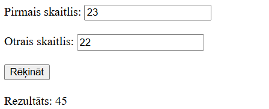
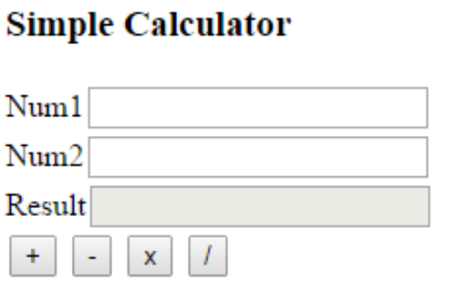

# Lesson: JavaScript Basics with Inline/External Scripts, Alerts, `window.onload`, and Updating Page Content

## Table of Contents
1. [Introduction to JavaScript in HTML](#1-introduction-to-javascript-in-html)  
2. [Inline vs. External Scripts](#2-inline-vs-external-scripts)  
3. [Popups: Alerts and Confirms](#3-popups-alerts-and-confirms)  
4. [The `window.onload` Event](#4-the-windowonload-event)  
5. [Updating the Page: `innerText` and `innerHTML`](#5-updating-the-page-innertext-and-innerhtml)  
6. [Working with Input Fields in JavaScript](#6-working-with-input-fields-in-javascript)  
7. [Activity: Basic Calculator](#7-activity-basic-calculator)  
8. [Extended Activity: Adding more operations](#8-extended-activity-adding-more-operations)  
9. [Activities to Become Fluent](#9-activities-to-become-fluent)  

---

## 1. Introduction to JavaScript in HTML

**JavaScript** is a programming language that makes web pages interactive. For example, when you press a button and see a pop-up message, JavaScript is behind it. 

- **HTML (Hypertext Markup Language)** is how you structure your web page (like headings, paragraphs, and images).
- **CSS (Cascading Style Sheets)** is how you style your page (like colors, fonts, and layouts).
- **JavaScript** is how you add interactivity (like buttons, pop-ups, and changing the text on the page).

---

## 2. Inline vs. External Scripts

You can add JavaScript to your HTML in **two main ways**:

1. **Inline scripts:** Write JavaScript code directly inside your HTML file:
   ```html
   <!DOCTYPE html>
   <html>
   <head>
     <title>Inline Script Example</title>
   </head>
   <body>
     <h1>Hello from Inline Script!</h1>

     <script>
       alert("This is an inline script!");
     </script>
   </body>
   </html>
   ```

2. **External scripts:** Put JavaScript code in a separate `.js` file:
   ```html
   <!-- index.html -->
   <!DOCTYPE html>
   <html>
   <head>
     <title>External Script Example</title>
     <script src="script.js"></script>
   </head>
   <body>
     <h1>Hello from External Script!</h1>
   </body>
   </html>
   ```
   ```js
   // script.js
   alert("This is an external script!");
   ```

**Which one to use?**  
- Inline scripts can be okay for very small demos.  
- External scripts are better for bigger projects because your code is easier to organize in separate files.

---

## 3. Popups: Alerts and Confirms

JavaScript lets you show pop-up boxes to the user:

- **`alert("message")`** shows a pop-up with just an **OK** button.  
- **`confirm("question")`** shows a pop-up with **OK** and **Cancel**. If the user clicks **OK**, `confirm` returns `true`. If they click **Cancel**, it returns `false`.

For example:
```js
let decision = confirm("Are you sure?");
if (decision) {
  alert("You clicked OK!");
} else {
  alert("You clicked Cancel!");
}
```

---

## 4. The `window.onload` Event

Sometimes, you want your JavaScript to run only **after** the entire page has loaded. You can do this by writing:

```js
window.onload = function() {
  // Code that runs after everything on the page has finished loading
};
```

**Example**:
```html
<!DOCTYPE html>
<html>
<head>
  <title>window.onload Example</title>
</head>
<body>
  <p id="text">Hello, I'm a paragraph!</p>

  <script>
    window.onload = function() {
      let element = document.getElementById("text");
      alert(element.innerText); // shows "Hello, I'm a paragraph!"
    };
  </script>
</body>
</html>
```

---

## 5. Updating the Page: `innerText` and `innerHTML`

1. **`innerText`**: Changes the *text* inside an element.
   ```js
   let heading = document.getElementById("myHeading");
   heading.innerText = "Hello, World!";
   ```

2. **`innerHTML`**: Changes the *HTML* inside an element (meaning you can add tags).
   ```js
   let heading = document.getElementById("myHeading");
   heading.innerHTML = "<strong>This text is bold!</strong>";
   ```

**Note**:  
- `innerText` only updates plain text (no HTML tags).  
- `innerHTML` can add HTML, such as `<strong>` or `<i>`, which changes how the text looks.

---

## 6. Working with Input Fields in JavaScript

Many web pages ask users to enter something, like text or numbers, in `<input>` fields. Examples:  
- `<input type="text">` for regular text  
- `<input type="number">` for numbers  
- `<input type="checkbox">` for checkboxes  
- `<input type="radio">` for radio buttons  
- `<select>` … `</select>` for drop-down menus  
- `<textarea>` … `</textarea>` for bigger text areas  

### 6.1. Getting and Setting the Value

1. **Text/Number Fields**  
   ```js
   let userNameField = document.getElementById("userName");
   let userName = userNameField.value; // reads what's typed
   userNameField.value = "New Name";   // sets a new value
   ```

2. **Checkboxes**  
   ```js
   let termsCheckbox = document.getElementById("acceptTerms");
   if (termsCheckbox.checked) {
     // The user checked the box
   } else {
     // The user did not check the box
   }
   ```

3. **Radio Buttons**  
   ```js
   let colorRed = document.getElementById("colorRed");
   let colorBlue = document.getElementById("colorBlue");

   if (colorRed.checked) {
     // user chose "Red"
   }
   if (colorBlue.checked) {
     // user chose "Blue"
   }
   ```

4. **Drop-down (`<select>`)**  
   ```js
   let mySelect = document.getElementById("mySelect");
   let selectedValue = mySelect.value;
   // If you need the label of the selected option:
   let selectedText = mySelect.options[mySelect.selectedIndex].text;
   ```

### 6.2. Example: Simple Form

```html
<!DOCTYPE html>
<html>
<head>
  <title>Input Fields Example</title>
</head>
<body>
  <input type="text" id="userName" placeholder="Enter your name">
  <button id="greetBtn">Greet Me</button>

  <p id="greeting"></p>

  <script>
    window.onload = function() {
      let greetButton = document.getElementById("greetBtn");
      greetButton.onclick = function() {
        let userNameField = document.getElementById("userName");
        let userName = userNameField.value; // read what the user typed
        
        let greetingPara = document.getElementById("greeting");
        greetingPara.innerText = "Hello, " + userName + "! Nice to see you.";
        
        userNameField.value = ""; // clears the input
      };
    };
  </script>
</body>
</html>
```

What happens here:
1. A user types a name in the input field.  
2. They click **“Greet Me”**.  
3. JavaScript reads the typed text and shows a greeting message in `<p id="greeting">`.  
4. The input field is then cleared.

---

## 7. Activity: Basic Calculator

### Goal
Make a calculator that **adds** two numbers and shows the result.

### Example



### Steps

1. **`index.html`**:
   ```html
   <!DOCTYPE html>
   <html lang="en">
   <head>
       <meta charset="UTF-8">
       <meta name="viewport" content="width=device-width, initial-scale=1.0">
       <title>Basic Calculator</title>
       <script src="script.js"></script>
   </head>
   <body>
       <label for="pirmais_skaitlis">Pirmais skaitlis:</label>
       <input type="number" id="pirmais_skaitlis">
       <br><br>
       <label for="otrais_skaitlis">Otrais skaitlis:</label>
       <input type="number" id="otrais_skaitlis">
       <br><br>
       <button id="rekinat">Rēķināt</button>
       <br><br>
       <div id="rezultats"></div>
   </body>
   </html>
   ```

2. **`script.js`**:
   ```js
   window.onload = function() {
     let button = document.getElementById("rekinat");

     button.onclick = function() {
       let pirmaisskaitlis = parseFloat(document.getElementById("pirmais_skaitlis").value);
       let otraisskaitlis = parseFloat(document.getElementById("otrais_skaitlis").value);

       let summa = pirmaisskaitlis + otraisskaitlis;

       document.getElementById("rezultats").textContent = "Rezultāts: " + summa;
     };
   };
   ```

3. Open **`index.html`** in a browser, type two numbers, then click **Rēķināt**. The sum of the two numbers will appear.

---

## 8. Extended Activity: Adding More Operations

### Goal
Add more **buttons** to do these operations:
1. **Add (+)**
2. **Subtract (-)**
3. **Multiply (\*)**
4. **Divide (/)**  
5. **% of** (For example, “10% of 100” = 10)
6. **mod** (Remainder: “10 mod 3” = 1)
7. **div** (Integer part of division: “10 div 3” = 3)
8. **x^y** (Exponent: “2^3” = 8)

### Example



### Steps

1. **HTML (index.html)**:
   ```html
   <!DOCTYPE html>
   <html lang="en">
   <head>
     <meta charset="UTF-8">
     <meta name="viewport" content="width=device-width, initial-scale=1.0">
     <title>Extended Calculator</title>
     <script src="script.js"></script>
   </head>
   <body>
     <h1>Extended Calculator</h1>

     <label for="num1">Number 1:</label>
     <input type="number" id="num1">

     <br><br>

     <label for="num2">Number 2:</label>
     <input type="number" id="num2">

     <br><br>

     <!-- Operation Buttons -->
     <button id="btnAdd">+</button>
     <button id="btnSubtract">-</button>
     <button id="btnMultiply">*</button>
     <button id="btnDivide">/</button>
     <button id="btnPercent">% of</button>
     <button id="btnMod">mod</button>
     <button id="btnDivInt">div</button>
     <button id="btnExponent">x^y</button>

     <br><br>

     <label for="result">Result:</label>
     <input type="text" id="result" readonly>
   </body>
   </html>
   ```

2. **JavaScript (script.js)**:
   ```js
   window.onload = function() {
     // Get the input fields
     const num1Field = document.getElementById("num1");
     const num2Field = document.getElementById("num2");
     const resultField = document.getElementById("result");

     // Helper function to parse user inputs
     function getNumbers() {
       const n1 = parseFloat(num1Field.value);
       const n2 = parseFloat(num2Field.value);
       return { n1, n2 };
     }

     // 1) ADD (+)
     document.getElementById("btnAdd").onclick = function() {
       const { n1, n2 } = getNumbers();
       resultField.value = n1 + n2;
     };

     // 2) SUBTRACT (-)
     document.getElementById("btnSubtract").onclick = function() {
       const { n1, n2 } = getNumbers();
       resultField.value = n1 - n2;
     };

     // 3) MULTIPLY (*)
     document.getElementById("btnMultiply").onclick = function() {
       const { n1, n2 } = getNumbers();
       resultField.value = n1 * n2;
     };

     // 4) DIVIDE (/)
     document.getElementById("btnDivide").onclick = function() {
       const { n1, n2 } = getNumbers();
       if (n2 === 0) {
         resultField.value = "Error: Division by 0!";
       } else {
         resultField.value = n1 / n2;
       }
     };

     // 5) PERCENT (% of)
     document.getElementById("btnPercent").onclick = function() {
       const { n1, n2 } = getNumbers();
       resultField.value = (n1 / 100) * n2;
     };

     // 6) MOD (Remainder)
     document.getElementById("btnMod").onclick = function() {
       const { n1, n2 } = getNumbers();
       if (n2 === 0) {
         resultField.value = "Error: Mod by 0!";
       } else {
         resultField.value = n1 % n2;
       }
     };

     // 7) DIV (Integer division)
     document.getElementById("btnDivInt").onclick = function() {
       const { n1, n2 } = getNumbers();
       if (n2 === 0) {
         resultField.value = "Error: Div by 0!";
       } else {
         resultField.value = Math.trunc(n1 / n2);
       }
     };

     // 8) EXPONENT (x^y)
     document.getElementById("btnExponent").onclick = function() {
       const { n1, n2 } = getNumbers();
       resultField.value = Math.pow(n1, n2);
     };
   };
   ```

3. **Try it out**:
   - Open `index.html` in your browser.
   - Enter two numbers.
   - Click any operation button to see the result.

---

## 9. Activities to Become Fluent

Here are **fun project ideas** to help you practice JavaScript, HTML, and CSS. You can use the same skills (get values from `<input>`, do calculations, show the result).

1. **Age Calculator**  
   - Have two date fields: one for a person’s birthdate and one for today’s date.  
   - When the user clicks “Calculate Age,” show how old they are in years (and maybe months/days).

2. **Perimeter & Area Calculator**  
   - Let the user choose a shape (like a rectangle, circle, or triangle).  
   - Ask them for the size of the shape (width and height, or radius, etc.).  
   - Calculate and show the **perimeter** (distance around the shape) and **area** (space inside it).

3. **Unit Conversion Calculator**  
   - Have a text field for a number and a drop-down for the “from” unit (like centimeters).  
   - Another drop-down for the “to” unit (like meters or millimeters).  
   - When the user clicks a button, show the converted value.

4. **Years Calculator (Humans, Dogs, and Cats)**  
   - Let the user type an age in human years.  
   - Let them choose if it’s for a **human, dog, or cat**.  
   - Convert the years to “dog years” or “cat years.” (For example, 1 dog year might be ~7 human years, depending on how you want to define it. You can look up simple rules for cat years too.)  
   - Show the result with a little explanation.

> **Tip**: You can make the design more fun with CSS. For example, show images of shapes or animals, change colors, or use different fonts.

---

# Summary

- **Inline Scripts**: JavaScript code inside your HTML file.  
- **External Scripts**: JavaScript in a separate `.js` file, linked to HTML.  
- **Popups**: Use `alert()` for simple messages, or `confirm()` for OK/Cancel.  
- **`window.onload`**: Runs code after the whole page finishes loading.  
- **`innerText` / `innerHTML`**: Change text or HTML content on the page.  
- **Input Fields**: Use `.value` to read or change text/number inputs, `.checked` for checkboxes and radio buttons, and `.value` for dropdowns.  
- **Calculator Activities**: Build small projects to practice input, output, and calculations in JavaScript.

Enjoy experimenting with JavaScript, and have fun making your own interactive web pages!