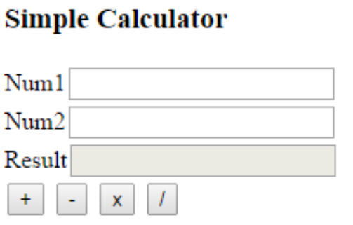

# Nodarbība: JavaScript pamati ar iebūvētajiem/ārējiem skriptiem, paziņojumiem (Alerts), `window.onload` un lapas satura atjaunošanu

## Satura rādītājs
1. [Ievads JavaScript HTML lapās](#1-ievads-javascript-html-lapās)  
2. [Iebūvētie vs. ārējie skripti](#2-iebūvētie-vs-ārējie-skripti)  
3. [Uznirstošie logi: Alerts un Confirms](#3-uznirstošie-logi-alerts-un-confirms)  
4. [Notikums `window.onload`](#4-notikums-windowonload)  
5. [Lapas atjaunošana: `innerText` un `innerHTML`](#5-lapas-atjaunošana-innertext-un-innerhtml)  
6. [Darbs ar ievades laukiem JavaScript](#6-darbs-ar-ievades-laukiem-javascript)  
7. [Aktivitāte: Vienkāršs kalkulators](#7-aktivitāte-vienkāršs-kalkulators)  
8. [Paplašināta aktivitāte: Vairāk darbību](#8-paplašināta-aktivitāte-vairāk-darbību)  
9. [Aktivitātes prasmju nostiprināšanai](#9-aktivitātes-prasmju-nostiprināšanai)

---

## 1. Ievads JavaScript un HTML lapās

**JavaScript** ir programmēšanas valoda, kas padara tīmekļa lapas interaktīvas. Piemēram, kad nospied pogu un parādās paziņojuma logs, tad „aizkulisēs” darbojas JavaScript.

- **HTML (Hypertext Markup Language)** nosaka, kā veido lapas struktūru (virsraksti, rindkopas, attēli).
- **CSS (Cascading Style Sheets)** nosaka, kā lapa izskatās (krāsas, šriftus, izkārtojumu).
- **JavaScript** pievieno interaktivitāti (piemēram, pogas, uznirstošus paziņojumus, teksta mainīšanu lapā).

---

## 2. Iebūvētie vs. ārējie skripti

Ir **divi galvenie veidi**, kā HTML lapai pievienot JavaScript kodu:

1. **Iebūvētais (inline) skripts:** JavaScript kods rakstīts tieši HTML failā:
   ```html
   <!DOCTYPE html>
   <html>
   <head>
     <title>Inline Script Example</title>
   </head>
   <body>
     <h1>Hello from Inline Script!</h1>

     <script>
       alert("This is an inline script!");
     </script>
   </body>
   </html>
   ```

2. **Ārējais skripts:** JavaScript kods atrodas atsevišķā `.js` failā:
   ```html
   <!-- index.html -->
   <!DOCTYPE html>
   <html>
   <head>
     <title>External Script Example</title>
     <script src="script.js"></script>
   </head>
   <body>
     <h1>Hello from External Script!</h1>
   </body>
   </html>
   ```
   ```js
   // script.js
   alert("This is an external script!");
   ```

**Kuru variantu lietot?**  
- Iebūvētie skripti noder maziem demonstrācijas piemēriem.  
- Ārējie skripti ir labāki lielākiem projektiem, jo kods būs vieglāk pārskatāms un kārtots atsevišķos failos.

---

## 3. Uznirstošie logi: Alerts un Confirms

JavaScript ļauj rādīt lietotājam uznirstošos paziņojumu logus:

- **`alert("ziņa")`** parāda paziņojuma logu ar **OK** pogu.  
- **`confirm("jautājums")`** parāda paziņojumu ar **OK** un **Cancel**. Ja lietotājs nospiež **OK**, `confirm` atgriež `true`. Ja lietotājs nospiež **Cancel**, atgriež `false`.

Piemēram:
```js
let decision = confirm("Are you sure?");
if (decision) {
  alert("You clicked OK!");
} else {
  alert("You clicked Cancel!");
}
```

---

## 4. Notikums `window.onload`

Dažkārt vēlamies, lai JavaScript kods sāktu darboties tikai **pēc** tam, kad visa lapa (HTML, attēli u.c.) ir ielādēta. Lai to panāktu, var rakstīt:

```js
window.onload = function() {
  // Kods, kas tiks izpildīts pēc pilnīgas lapas ielādes
};
```

**Piemērs**:
```html
<!DOCTYPE html>
<html>
<head>
  <title>window.onload Example</title>
</head>
<body>
  <p id="text">Hello, I'm a paragraph!</p>

  <script>
    window.onload = function() {
      let element = document.getElementById("text");
      alert(element.innerText); // parāda "Hello, I'm a paragraph!"
    };
  </script>
</body>
</html>
```

---

## 5. Lapas atjaunošana: `innerText` un `innerHTML`

1. **`innerText`**: Maina *tekstu* elementā.
   ```js
   let heading = document.getElementById("myHeading");
   heading.innerText = "Hello, World!";
   ```

2. **`innerHTML`**: Maina *HTML* saturu elementā (ieskaitot tagus).
   ```js
   let heading = document.getElementById("myHeading");
   heading.innerHTML = "<strong>This text is bold!</strong>";
   ```

**Piezīme**:  
- `innerText` maina tikai tekstu (bez HTML tagiem).  
- `innerHTML` ļauj ielikt HTML tagus (piemēram, `<strong>` vai `<i>`), kas ietekmē teksta izskatu.

---

## 6. Darbs ar ievades laukiem JavaScript

Daudzās tīmekļa lapās ir ievades lauki (`<input>`) lietotāja datiem. Daži piemēri:  
- `<input type="text">` parasts teksts  
- `<input type="number">` skaitlis  
- `<input type="checkbox">` izvēles rūtiņa  
- `<input type="radio">` radio poga  
- `<select>` … `</select>` izvēlne ar iespējām  
- `<textarea>` … `</textarea>` garāks teksta lauks  

### 6.1. Ievades nolasīšana un iestatīšana

1. **Teksta/skaitļa lauki**  
   ```js
   let userNameField = document.getElementById("userName");
   let userName = userNameField.value; // nolasa ievadīto tekstu
   userNameField.value = "New Name";   // iestata jaunu vērtību
   ```

2. **Izvēles rūtiņas (checkbox)**  
   ```js
   let termsCheckbox = document.getElementById("acceptTerms");
   if (termsCheckbox.checked) {
     // Lietotājs rūtiņu ir atzīmējis
   } else {
     // Lietotājs rūtiņu nav atzīmējis
   }
   ```

3. **Radio pogas**  
   ```js
   let colorRed = document.getElementById("colorRed");
   let colorBlue = document.getElementById("colorBlue");

   if (colorRed.checked) {
     // lietotājs izvēlējies "Red"
   }
   if (colorBlue.checked) {
     // lietotājs izvēlējies "Blue"
   }
   ```

4. **Izvēlne (`<select>`)**  
   ```js
   let mySelect = document.getElementById("mySelect");
   let selectedValue = mySelect.value;
   // Ja vajag iegūt izvēlētā varianta tekstu:
   let selectedText = mySelect.options[mySelect.selectedIndex].text;
   ```

### 6.2. Piemērs: Vienkārša forma

```html
<!DOCTYPE html>
<html>
<head>
  <title>Input Fields Example</title>
</head>
<body>
  <input type="text" id="userName" placeholder="Enter your name">
  <button id="greetBtn">Greet Me</button>

  <p id="greeting"></p>

  <script>
    window.onload = function() {
      let greetButton = document.getElementById("greetBtn");
      greetButton.onclick = function() {
        let userNameField = document.getElementById("userName");
        let userName = userNameField.value; // nolasa ievadīto tekstu
        
        let greetingPara = document.getElementById("greeting");
        greetingPara.innerText = "Hello, " + userName + "! Nice to see you.";
        
        userNameField.value = ""; // notīra ievades lauku
      };
    };
  </script>
</body>
</html>
```

Kas šeit notiek:
1. Lietotājs ievada savu vārdu laukā.  
2. Nospiež pogu **“Greet Me”**.  
3. JavaScript nolasa ievadīto vārdu un parāda sveicienu `<p id="greeting">`.  
4. Ievades lauks tiek notīrīts (iestatīts uz “”).

---

## 7. Aktivitāte: Vienkāršs kalkulators

### Mērķis
Izveidot kalkulatoru, kas **saskaita** divus skaitļus un parāda rezultātu.

### Piemērs


### Darbības soļi

1. **`index.html`**:
   ```html
   <!DOCTYPE html>
   <html lang="en">
   <head>
       <meta charset="UTF-8">
       <meta name="viewport" content="width=device-width, initial-scale=1.0">
       <title>Basic Calculator</title>
       <script src="script.js"></script>
   </head>
   <body>
       <label for="pirmais_skaitlis">Pirmais skaitlis:</label>
       <input type="number" id="pirmais_skaitlis">
       <br><br>
       <label for="otrais_skaitlis">Otrais skaitlis:</label>
       <input type="number" id="otrais_skaitlis">
       <br><br>
       <button id="rekinat">Rēķināt</button>
       <br><br>
       <div id="rezultats"></div>
   </body>
   </html>
   ```

2. **`script.js`**:
   ```js
   window.onload = function() {
     let button = document.getElementById("rekinat");

     button.onclick = function() {
       let pirmaisskaitlis = parseFloat(document.getElementById("pirmais_skaitlis").value);
       let otraisskaitlis = parseFloat(document.getElementById("otrais_skaitlis").value);

       let summa = pirmaisskaitlis + otraisskaitlis;

       document.getElementById("rezultats").textContent = "Rezultāts: " + summa;
     };
   };
   ```

3. Atver **`index.html`** pārlūkā, ievadi divus skaitļus, un tad nospied **Rēķināt**. Zem pogas parādīsies abu skaitļu summa.

---

## 8. Paplašināta aktivitāte: Vairāk darbību

### Mērķis
Pievienot vairāk **pogu**, lai izpildītu šādas darbības:
1. **Add (+)**  
2. **Subtract (-)**  
3. **Multiply (\*)**  
4. **Divide (/)**  
5. **% of** (piemēram, “10% of 100” = 10)  
6. **mod** (atlikums: “10 mod 3” = 1)  
7. **div** (veselās daļas dalīšana: “10 div 3” = 3)  
8. **x^y** (pakāpe: “2^3” = 8)

### Piemērs



### Darbības soļi

1. **HTML (index.html)**:
   ```html
   <!DOCTYPE html>
   <html lang="en">
   <head>
     <meta charset="UTF-8">
     <meta name="viewport" content="width=device-width, initial-scale=1.0">
     <title>Extended Calculator</title>
     <script src="script.js"></script>
   </head>
   <body>
     <h1>Extended Calculator</h1>

     <label for="num1">Number 1:</label>
     <input type="number" id="num1">

     <br><br>

     <label for="num2">Number 2:</label>
     <input type="number" id="num2">

     <br><br>

     <!-- Pogas darbībām -->
     <button id="btnAdd">+</button>
     <button id="btnSubtract">-</button>
     <button id="btnMultiply">*</button>
     <button id="btnDivide">/</button>
     <button id="btnPercent">% of</button>
     <button id="btnMod">mod</button>
     <button id="btnDivInt">div</button>
     <button id="btnExponent">x^y</button>

     <br><br>

     <label for="result">Result:</label>
     <input type="text" id="result" readonly>
   </body>
   </html>
   ```

2. **JavaScript (script.js)**:
   ```js
   window.onload = function() {
     // Iegūstam ievades laukus
     const num1Field = document.getElementById("num1");
     const num2Field = document.getElementById("num2");
     const resultField = document.getElementById("result");

     // Palīgfunkcija lietotāja ievades pārveidošanai skaitļos
     function getNumbers() {
       const n1 = parseFloat(num1Field.value);
       const n2 = parseFloat(num2Field.value);
       return { n1, n2 };
     }

     // 1) ADD (+)
     document.getElementById("btnAdd").onclick = function() {
       const { n1, n2 } = getNumbers();
       resultField.value = n1 + n2;
     };

     // 2) SUBTRACT (-)
     document.getElementById("btnSubtract").onclick = function() {
       const { n1, n2 } = getNumbers();
       resultField.value = n1 - n2;
     };

     // 3) MULTIPLY (*)
     document.getElementById("btnMultiply").onclick = function() {
       const { n1, n2 } = getNumbers();
       resultField.value = n1 * n2;
     };

     // 4) DIVIDE (/)
     document.getElementById("btnDivide").onclick = function() {
       const { n1, n2 } = getNumbers();
       if (n2 === 0) {
         resultField.value = "Error: Division by 0!";
       } else {
         resultField.value = n1 / n2;
       }
     };

     // 5) PERCENT (% of)
     document.getElementById("btnPercent").onclick = function() {
       const { n1, n2 } = getNumbers();
       resultField.value = (n1 / 100) * n2;
     };

     // 6) MOD (Remainder)
     document.getElementById("btnMod").onclick = function() {
       const { n1, n2 } = getNumbers();
       if (n2 === 0) {
         resultField.value = "Error: Mod by 0!";
       } else {
         resultField.value = n1 % n2;
       }
     };

     // 7) DIV (Integer division)
     document.getElementById("btnDivInt").onclick = function() {
       const { n1, n2 } = getNumbers();
       if (n2 === 0) {
         resultField.value = "Error: Div by 0!";
       } else {
         resultField.value = Math.trunc(n1 / n2);
       }
     };

     // 8) EXPONENT (x^y)
     document.getElementById("btnExponent").onclick = function() {
       const { n1, n2 } = getNumbers();
       resultField.value = Math.pow(n1, n2);
     };
   };
   ```

3. **Izmēģinājums**:
   - Atver `index.html` pārlūkā.
   - Ievadi divus skaitļus.
   - Nospied kādu no darbību pogām, lai redzētu rezultātu.

---

## 9. Aktivitātes prasmju nostiprināšanai

Te ir **jautras projektu idejas**, kur vari vingrināties JavaScript, HTML un CSS. Izmanto tādas pašas prasmes (nolasīt vērtības no `<input>`, veikt aprēķinus, rādīt rezultātu).

1. **Vecuma kalkulators**  
   - Izveido divus datuma laukus: vienu dzimšanas datumam un otru šodienas datumam.  
   - Kad lietotājs nospiež “Calculate Age”, parādi, cik viņam/viņai ir gadi (var pievienot arī mēnešus/dienas).

2. **Perimetra un laukuma kalkulators**  
   - Ļauj lietotājam izvēlēties figūras veidu (piemēram, taisnstūri, apli vai trīsstūri).  
   - Palūdz ievadīt figūras izmērus (platums, augstums, rādiuss u.c.).  
   - Aprēķini un parādi **perimetru** (figūras ārējo robežu) un **laukumu** (platību figūras iekšienē).

3. **Mērvienību konvertētājs**  
   - Izveido teksta lauku skaitlim un nolaižamo sarakstu “no” mērvienības (piemēram, centimetri).  
   - Otru nolaižamo sarakstu “uz” mērvienību (piemēram, metri vai milimetri).  
   - Kad lietotājs nospiež pogu, parādi pārveidoto vērtību.

4. **Gadu kalkulators (cilvēks, suns, kaķis)**  
   - Lietotājs ievada vecumu “cilvēka gados”.  
   - Izvēlas, vai tas ir paredzēts **cilvēkam, sunim vai kaķim**.  
   - Pārveido gadus “suņa gados” vai “kaķa gados”. (Piemēram, 1 suņa gads aptuveni = 7 cilvēka gadi, atkarībā no izvēlētā aprēķina principa. Līdzīgi arī kaķa gadiem.)  
   - Parādi rezultātu ar īsu skaidrojumu.

> **Padoms**: Dari dizainu interesantāku ar CSS. Piemēram, pievieno formas vai dzīvnieku attēlus, maini krāsas un šriftus, lai lapa būtu pievilcīgāka.

---

# Kopsavilkums

- **Iebūvētie skripti (Inline Scripts)**: JavaScript kods rakstīts tieši HTML failā.  
- **Ārējie skripti (External Scripts)**: JavaScript ievietots atsevišķā `.js` failā, kas ir piesaistīts HTML dokumentam.  
- **Uznirstošie logi (Popups)**: lieto `alert()` vienkāršiem paziņojumiem un `confirm()` OK/Cancel atbildēm.  
- **`window.onload`**: nodrošina, ka kods tiks izpildīts tikai pēc visas lapas ielādes.  
- **`innerText` / `innerHTML`**: maina teksta vai HTML saturu lapā.  
- **Ievades lauki**: lieto `.value` teksta/skaitļu lauku nolasei vai maiņai, `.checked` izvēles rūtiņām un radio pogām, bet `.value` nolaižamajām izvēlnēm.  
- **Kalkulatora aktivitātes**: veido nelielus projektus, lai praktizētu ievades, izvades un aprēķinu veidošanu JavaScript.

Lai veicas ar JavaScript apgūšanu un aizraujošu interaktīvo tīmekļa lapu veidošanu!